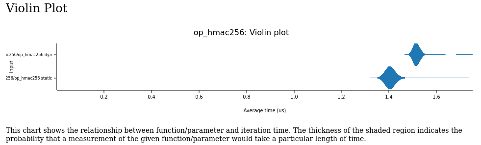

# tlspuffin - TLS Protocol Under FuzzINg

## Setup

Install [rustup](https://rustup.rs/).

The toolchain will be automatically downloaded when building this project. See [./rust-toolchain.toml](./rust-toolchain.toml) for more details about the toolchain.

Make sure that you have the [clang](https://clang.llvm.org/) compiler installed. Optionally, also install `llvm` to have additional tools like `sancov` available.
Also make sure that you have the usual tools for building it like `make`, `gcc` etc. installed. They may be needed to build OpenSSL.

Now, build the project:

```bash
git clone git@gitlab.inria.fr:mammann/tlspuffin.git
git submodule update --init --recursive
cargo build
```

## Run

Fuzz using three clients:

```bash
RUST_LOG=trace cargo run --bin tlspuffin -- -n 3
```

## Generate Corpus Seeds

```bash
RUST_LOG=trace cargo run --bin tlspuffin -- seed
```

## Plot traces

To plot SVGs do the following:

```bash
RUST_LOG=trace cargo run --bin tlspuffin -- plot corpus/seed_client_attacker12.trace svg ./plots/seed_client_attacker12
```

Note: This requires that the `dot` binary is in on your path.
Note: The utility [tools/plot-corpus.sh](tools/plot-corpus.sh) plots a whole directory

### Tests

```bash
cargo test
```

### Benchmark

There is a benchmark which compares the execution of the dynamic functions to directly executing them
in [benchmark.rs](benches/benchmark.rs). You can run them using:

```bash
cargo bench
xdg-open target/criterion/report/index.html
```

Results:



## Documentation

This generates the documentation for this crate and opens the browser. This also includes the documentation of every
dependency like LibAFL or rustls.

```bash
cargo doc --open
```

You can also view the up-to-date documentation [here](https://mammann.gitlabpages.inria.fr/tlspuffin/tlspuffin/).

## Interesting Libraries:

* Graph/Tree https://sachanganesh.com/programming/graph-tree-traversals-in-rust/
    * https://rosettacode.org/wiki/Visualize_a_tree#Rust
* Plot Tree Plotly
    * https://plotly.com/python/tree-plots/
    * https://docs.rs/plotly/0.6.0/plotly/scatter/struct.Scatter.html
* https://github.com/google/evcxr/blob/master/evcxr_jupyter/samples/evcxr_jupyter_tour.ipynb
