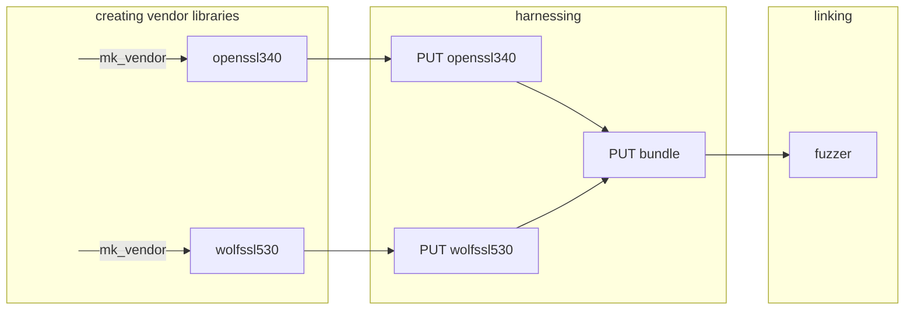

:::warning[Ongoing Work]

This page is currently under development. Information presented here might be incomplete or outdated.

:::

## `puffin-build`

The different steps of the build process are implemented in the Rust crate `puffin-build` and summarize below:




## Creating vendor libraries

- library are built from upstream sources (e.g. OpenSSL, BoringSSL, ...)
- stored in **VENDOR_DIR** (defaults to `./vendor`)
- **mk_vendor** is a binary from the `puffin-build` crate to build vendor libraries using **presets**
- presets are located in `puffin-build/vendor/<library>/presets.toml`

### mk_vendor

The goal of `mk_vendor` is to automate the creation of vendor libraries by providing a number of *preset* configurations. Alongside the built library, it also dumps specific metadata that are used later by the harness.

For example, building OpenSSL 3.1.2 and wolfSSL 5.3.0 with ASAN can be simply done with the two presets `openssl312` and `wolfssl530-asan`:
```sh
./tools/mk_vendor openssl:openssl312
./tools/mk_vendor wolfssl:wolfssl530-asan
```

:::tip[wrapper script]

To avoid complex calls to `cargo` and for historical reasons, we provide a wrapper script to run `mk_vendor` directly from the puffin repository toplevel:
```sh
./tools/mk_vendor [ARGS]
```

This is simply an advanced version of running:
```sh
cargo run --bin mk_vendor -- [ARGS]
```

:::

Vendor library presets are stored in `puffin-build/vendors/<library>/presets.toml`. Each section in this file is a preset defining:
- the url/path to fetch the library sources.
- the script to build the library.
- the options for the build script.

For example, the section for the preset `openssl340-asan` is in `puffin-build/vendors/openssl/presets.toml`:
```toml
[openssl340-asan]
sources = { repo = "https://github.com/tlspuffin/openssl", branch = "fuzz-OpenSSL_3_4", version = "3.4.0" }
builder = { type = "builtin", name = "openssl" }
asan = true
sancov = true
```

The exact format can be found by looking at the deserialized Rust struct <a href="/api/puffin_build/library/struct.Config.html">puffin_build::library::Config</a>.

## Harnessing

- the **harness** is responsible for creating a PUT from a compatible vendor library
- library specific
- protocol specific
- stored in `<protocol>/harness/<library>` (e.g. `tlspuffin/harness/openssl`)
- creates a **PUT**, an interface around the vendor library intended for the fuzzer to perform operations in a generic way (agent creation, inter-agent communication, ...)
- several PUT are then bundled together for linking with the fuzzer. The bundle consists in:
    - a static library containing all the PUT object files and can be linked with the final Rust fuzzer binary
    - a Rust bindings file which contains the necessary code for *registration* of the the linked PUTs into the final binary

## Linking

- use cargo build script to dump necessary metadata through `bundle.print_cargo_metadata()`
    - defines environment variable `RUST_PUTS_BUNDLE_FILE` pointing to the Rust bindings file
    - setup link paths for Rust to link with the bundle library

See `tlspuffin/build.rs` for a full example of how the `puffin-build` crate is used to harness and bundle the vendor libraries in VENDOR_DIR and produce the necessary cargo metadata.
