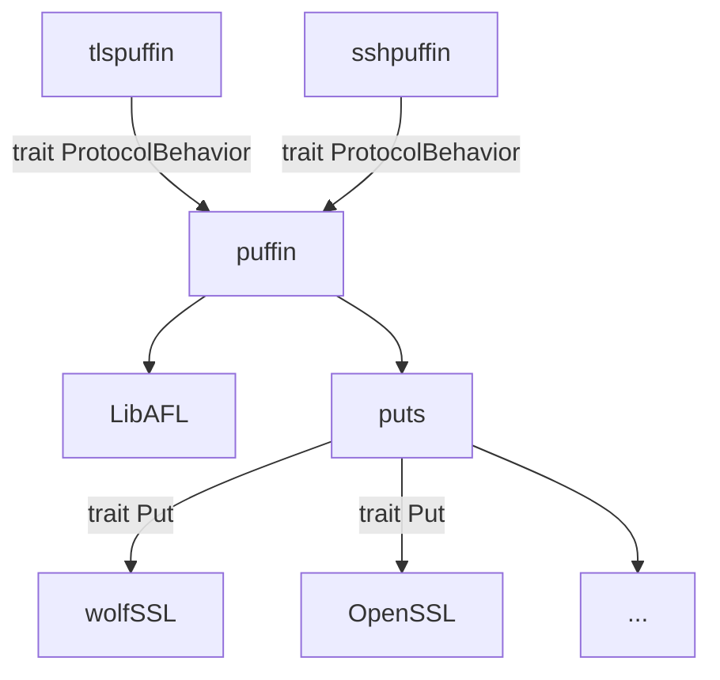

## Implementation

From an implementation perspective, several modules exist to make the fuzzer reusable.

### Fuzzing loop
The main fuzzing loop is made of the following modules, each at a different layer (from high-level to low-level):
  1. [`puffin`](https://github.com/tlspuffin/tlspuffin/tree/main/puffin): Core fuzzing engine which is protocol- and target-agnostic. It deals at a high level with the *terms algebra*, the input *traces* and the fuzzing process (scheduling, logging, mutations, ...). This module is built on top of the [`libAFL`](https://github.com/AFLplusplus/LibAFL) crate. 
  2. [`tlspuffin`](https://github.com/tlspuffin/tlspuffin/tree/main/tlspuffin): TLS fuzzer which instantiates `puffin` to the TLS protocol and is PUTs-agnostic. It notably instantiates the traces to TLS traces with the TLS-specific terms and functions for the TLS terms algebra, based on the `rustls` crate (e.g., ECSDA signatures, ECDHE encryption, ClientHello, etc.).
  3. `harness`, for example for OpenSSL PUTs: [harness/openssl](https://github.com/tlspuffin/tlspuffin/tree/main/tlspuffin/harness/openssl) - Harnesses for some PUTs.

Finally, other protocols and PUTs can be fuzzed as well, by extending the fuzzer at layer 2. (new protocols) and 3. (new PUTs harnesses).. We did a preliminary version of those for SSH and OpenSSH in the module [`sshpuffin` (WIP)](https://github.com/tlspuffin/tlspuffin/tree/main/sshpuffin).

The following diagram shows the dependencies between the modules:

The interfaces between the modules are defined by the following Rust traits which define what a protocol is and what a PUT harness is:
[`ProtocolBehavior`](https://tlspuffin.github.io/api/puffin/protocol/trait.ProtocolBehavior.html) and [`Put<PB: ProtocolBehavior>`](https://tlspuffin.github.io/api/puffin/put/trait.Put.html).

### Program Under Tests (PUTs)
The fuzzer then requires a *target* (that is a harness linked to some PUT) to fuzz. To build the PUTs (vendor libraries) and link them to the fuzzer, the following tooling is used:
  - [`puffin-build`](https://github.com/tlspuffin/tlspuffin/tree/main/puffin-build) (generates the `mk_vendor` tool): contains a crate implements the [build process](./build), from creating *PUTs* (*vendor libraries*) to linking PUTs into the fuzzer (through some fuzzing *harness*).

### Benchmarks
To benchmark the fuzzer and perform regression tests, the following tooling is used:
  - [puffin-bench](https://github.com/tlspuffin/puffin-bench): performance testbench for the `puffin` fuzzer (external tooling; not part to the `puffin` crate), see [benchmarks](./benchmarks).

## Setup

:::warning[Ongoing Work]

The rest of this page is currently under development. Information presented here might be incomplete or outdated.

:::

Configure your environment for developement on the puffin project:

- nix
- editor setup
    - vscode (recommended extensions, change default features, ...)
## Testing my changes

- justfile: use `just fmt` for code formatting, `just check` for basic checks, and `just check-workspace` for more advanced checks. Under-the-hood, it uses:
    - rustfmt
    - clang-format
    - cargo clippy
    - cargo bench
- github PRs/github CI: use the PR's labels `ci:none`, `ci:fast`, `ci:full` to fine-tune the CI checks. The full checks (`ci-full`) must be checked prior to merging PRs.
- [puffin-bench](https://github.com/tlspuffin/puffin-bench): run `uv run benchmark` for end-to-end, long, and comprehensive regressions and performance checks, see [benchmarks](./benchmarks).
