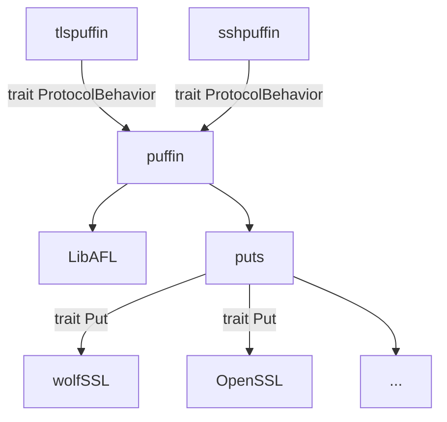

import Architecture from './libafl-architecture_new.drawio.svg';


# What is tlspuffin?

The tlspuffin fuzzer is the reference implementation for the [Dolev-Yao fuzzing approach](https://www.computer.org/csdl/pds/api/csdl/proceedings/download-article/1Ub234bjuWA/pdf).
The fuzzer mostly fuzzes TLS implementations like OpenSSL, LibreSSL, or wolfSSL, but can also fuzz other cryptographic protocols like SSH. Internally, puffin uses [LibAFL](https://aflplus.plus/libafl-book/) to drive the fuzzing loop.

## Fuzzing Loop

The following image shows the terminology and the flow of test cases through the fuzzer. We typically start the fuzzing with some "happy protocol flows" in the corpus.

<Architecture />

- **State:** Comprising "Corpus" and "Objectives," this stores all test cases with their traces and metadata, with the Objectives focusing specifically on cases that have triggered security violations.
- **Scheduler:** This selects and schedules test cases from the Corpus for mutation and re-testing, based on various strategic criteria.
- **Mutational Stage:** The "Mutator" alters a trace from a scheduled test case to create a mutated test case, which is then sent to the harness.
- **Harness:** The harness executes the mutated test case in the Program Under Test (PUT) and observes the execution.
- **Feedback:** This component evaluates the observed outcomes of the test case execution, adding interesting cases to the Corpus for further testing.
- **Objective Oracle:** It checks test cases for violations of security policies, adding those that do violate to the Objectives for focused analysis.

## Implementation

From an implementation perspective, several modules exist to make the fuzzer reusable:

- [puffin](https://github.com/tlspuffin/tlspuffin/tree/main/puffin) - Core fuzzing engine which is protocol agnostic.
- [tlspuffin](https://github.com/tlspuffin/tlspuffin/tree/main/tlspuffin) -  TLS fuzzer which uses puffin and is implementation agnostic.
- [sshpuffin (WIP)](https://github.com/tlspuffin/tlspuffin/tree/main/sshpuffin) -  SSH fuzzer which uses puffin and is implementation agnostic. 
- [puts](https://github.com/tlspuffin/tlspuffin/tree/main/puts) - Linkable Programs Under Test that can be linked with tlspuffin or sshpuffin. 




The interfaces between the modules are defined by the following Rust traits which define what a protocol is and what a Put is.

#### Protocol

```Rust
pub trait ProtocolBehavior: 'static {
    type Claim: Claim;
    type SecurityViolationPolicy: SecurityViolationPolicy<Self::Claim>;

    type ProtocolMessage: ProtocolMessage<Self::OpaqueProtocolMessage>;
    type OpaqueProtocolMessage: OpaqueProtocolMessage;

    type Matcher: Matcher
        + for<'a> TryFrom<&'a MessageResult<Self::ProtocolMessage, Self::OpaqueProtocolMessage>>;

    /// Get the signature that is used in the protocol
    fn signature() -> &'static Signature;

    /// Creates a sane initial seed corpus.
    fn create_corpus() -> Vec<(Trace<Self::Matcher>, &'static str)>;
}

pub struct MessageResult<M: ProtocolMessage<O>, O: OpaqueProtocolMessage>(pub Option<M>, pub O);

/// A structured message. This type defines how all possible messages of a protocol.
/// Usually this is implemented using an `enum`.
pub trait ProtocolMessage<O: OpaqueProtocolMessage>: Clone + Debug {
    fn create_opaque(&self) -> O;
    fn debug(&self, info: &str);
    fn extract_knowledge(&self) -> Result<Vec<Box<dyn VariableData>>, Error>;
}

/// A non-structured version of [`ProtocolMessage`]. This can be used for example for encrypted messages
/// which do not have a structure.
pub trait OpaqueProtocolMessage: Clone + Debug + Codec {
    fn debug(&self, info: &str);

    fn extract_knowledge(&self) -> Result<Vec<Box<dyn VariableData>>, Error>;
}
```


#### Put

```Rust
pub trait Put<PB: ProtocolBehavior>:
    Stream<PB::ProtocolMessage, PB::OpaqueProtocolMessage> + 'static
{
    /// Process incoming buffer, internal progress, can fill in the output buffer
    fn progress(&mut self) -> Result<(), Error>;

    /// In-place reset of the state
    fn reset(&mut self, new_name: AgentName) -> Result<(), Error>;

    fn descriptor(&self) -> &AgentDescriptor;

    /// Returns a textual representation of the state in which self is
    fn describe_state(&self) -> String;

    /// Checks whether the Put is in a good state
    fn is_state_successful(&self) -> bool;

    /// Shut down the PUT by consuming it and returning a string that summarizes the execution.
    fn shutdown(&mut self) -> String;

    /// Returns a textual representation of the version of the PUT used by self
    fn version() -> String
    where
        Self: Sized;
}
```

