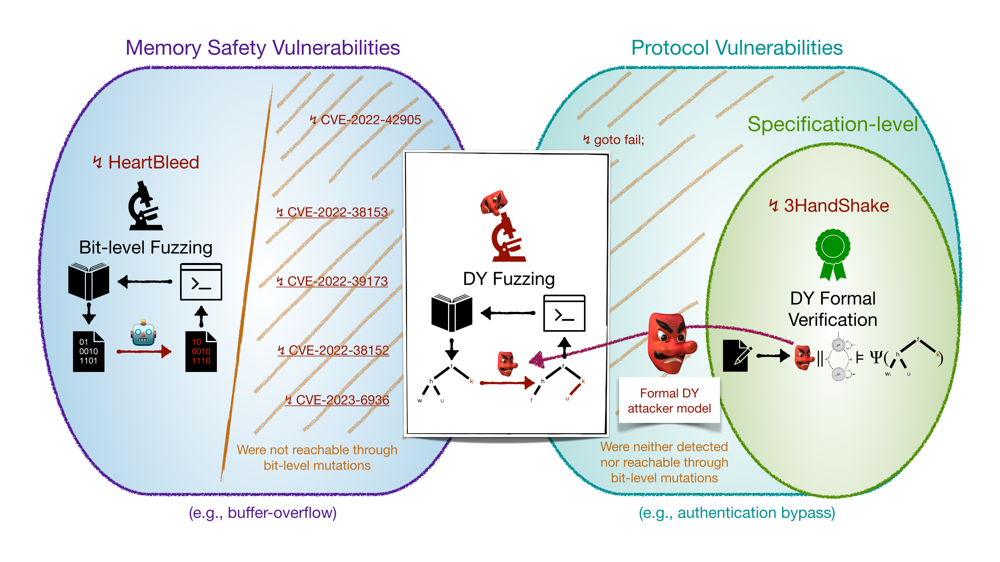

import Home from '@site/src/components/HomepageHeader';

<Home />

<iframe width="700" height="394" src="https://www.youtube.com/embed/vvwJzb-JU2I?si=smUlEp26W_GOB4Lu" title="YouTube video player" frameborder="0" allow="accelerometer; autoplay; clipboard-write; encrypted-media; gyroscope; picture-in-picture; web-share" referrerpolicy="strict-origin-when-cross-origin" allowfullscreen></iframe>

Critical and widely used cryptographic protocols have repeatedly been found to contain flaws in their design and implementation. A prominent class of such vulnerabilities is **logical attacks**, e.g., attacks that exploit flawed protocol logic. Automated formal verification methods, based on the **Dolev-Yao (DY) attacker** (shown in green in the Figure below), formally define and excel at finding such flaws but operate only on abstract specification models. Fully automated verification of existing protocol implementations is today still out of reach. This leaves open whether such implementations are secure. Unfortunately, this blind spot hides numerous attacks, such as recent logical attacks on widely used TLS implementations introduced by implementation bugs.

### Challenges in Detecting Implementation-Level Logical Attacks

We are concerned with finding implementation-level logical attacks in large cryptographic protocol code bases. For this, we build on **fuzz testing**. However, state-of-the-art fuzzers (shown on the left in the Figure) cannot capture the class of logical attacks for two main reasons. First, they fail to effectively **capture the DY attacker**, particularly the ability of structural modifications on the term representation of messages in DY models (e.g., re-signing a message with some adversarial-controlled key), a prerequisite to capture logical attacks. We emphasize that logical attacks may trigger protocol or memory vulnerabilities. Second, they cannot detect **protocol vulnerabilities**, which are security violations at the protocol level, e.g., for the attacks that trigger protocol vulnerabilities, which are not memory-related, such as an authentication bypass.

###  DY Model-Guided Fuzzing

We answer in [1] by proposing a novel and effective technique called DY model-guided fuzzing, which precludes logical attacks against protocol implementations. The main idea is to consider as possible test cases the set of abstract DY executions of the DY attacker, and use a novel mutation-based fuzzer to explore this set (shown in the middle of the Figure). The DY fuzzer concretizes each abstract execution to test it on the program under test. This approach enables reasoning at a more structural and security-related level of messages represented as formal terms (e.g., decrypt a message and re-encrypt it with a different key) instead of random bit-level modifications that are much less likely to produce relevant logical adversarial behaviors.

 

The gap filled by DY fuzzing and tlspuffin (shown in the middle).

### Implementation

[tlspuffin](https://github.com/tlspuffin/tlspuffin) is our reference implementation of such a DY fuzzer. It is built modularly so that new protocols and Programs Under Test (PUTs) can be integrated and tested. We have already integrated the TLS protocol and the OpenSSL, BoringSSL, WolfSSL, and LibreSSL PUTs. tlspuffin has already found 8 CVEs, including five new ones (including a critical one) that were all acknowledged and patched.
Interestingly and as a witness to the claims above,
those five newly found bugs are not currently found by state-of-the-art fuzzers [1].

### Results

We implement a full-fledged and modular DY protocol fuzzer.
We demonstrate its effectiveness by fuzzing three popular TLS implementations, resulting in the discovery of five novel vulnerabilities.

| CVE ID                                                             | CVSS | Type         | Novel | Version   |
|--------------------------------------------------------------------|------|--------------|-----|---------|
| [2021-3449](https://www.cve.org/CVERecord?id=CVE-2021-3449)        | 5.9  | Server DoS | ✖ | 1.1.1j   |
| [2022-25638](https://www.cve.org/CVERecord?id=CVE-2022-25638)      | 6.5  | Auth. Bypass | ✖ | 5.1.0   |
| [2022-25640](https://www.cve.org/CVERecord?id=CVE-2022-25640)      | 7.5  | Auth. Bypass | ✖ | 5.1.0     |
| [2022-38152](https://www.cve.org/CVERecord?id=CVE-2022-38152)      | 7.5  | Server DoS | ✔ | 5.4.0     |
| [2022-38153](https://www.cve.org/CVERecord?id=CVE-2022-38153)      | 5.9  | Client DoS | ✔ | 5.3.0     |
| [2022-39173](https://www.cve.org/CVERecord?id=CVE-2022-39173)      | 7.5  | Server DoS | ✔ | 5.5.0    |
| [2022-42905](https://www.cve.org/CVERecord?id=CVE-2022-42905)      | 9.1  | Info. Leak | ✔ | 5.5.0   |
| [2023-6936](https://www.cve.org/CVERecord?id=CVE-2023-6936)      | 5.3  | Info. Leak | ✔ | 5.6.6     |

## Team

- [Max Ammann](https://github.com/maxammann) - [Trails of Bits](https://www.trailofbits.com/)
- [Tom Gouville](https://github.com/aeyno) - [Loria](https://www.loria.fr), [Inria](https://www.inria.fr)
- [Lucca Hirschi](https://members.loria.fr/LHirschi/) - [Loria](https://www.loria.fr), [Inria](https://www.inria.fr)
- [Steve Kremer](https://members.loria.fr/SKremer/) - [Loria](https://www.loria.fr), [Inria](https://www.inria.fr)
- [Michael Mera](https://github.com/michaelmera) - [Loria](https://www.loria.fr), [Inria](https://www.inria.fr)

This project is partially funded by the [ANR JCJC project ProtoFuzz](https://project.inria.fr/protofuzz/).
We are still looking to hire motivated students/postdocs/engineers in Nancy, France as part of this project.

## Publications

1. [M. Ammann, L. Hirschi and S. Kremer, "DY Fuzzing: Formal Dolev-Yao Models Meet Cryptographic Protocol Fuzz Testing," in 2024 IEEE Symposium on Security and Privacy (SP), San Francisco, CA, USA, 2024 pp. 99-99.](https://www.computer.org/csdl/pds/api/csdl/proceedings/download-article/1Ub234bjuWA/pdf)
2. [DY Fuzzing Poster](/SP24_Poster.pdf)
